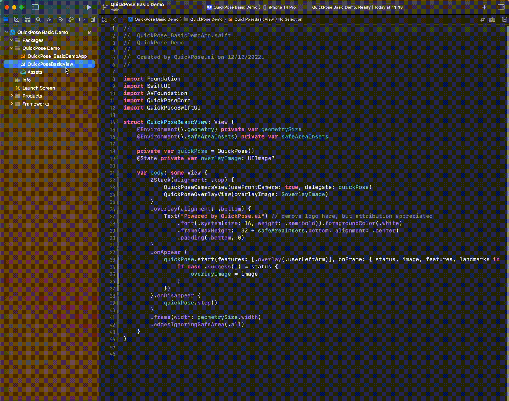

# quickpose-ios-sdk

 

QuickPose provides developer-oriented cutting edge ML features of MediaPipe and BlazePose. with easy integration, production ready code. Dramatically improving the speed of implementation of MediaPipe and BlazePose into mobile applications.

<!-- START doctoc generated TOC please keep comment here to allow auto update -->
<!-- DON'T EDIT THIS SECTION, INSTEAD RE-RUN doctoc TO UPDATE -->

- [Features](#features)
- [Requirements](#requirements)
- [Installing the SDK](#installing-the-sdk)
  - [Swift Package Manager](#swift-package-manager)

<!-- END doctoc generated TOC please keep comment here to allow auto update -->

Features
------------------

| Feature       | Example       | Supported |
| ------------- |:-------------:| ---------:|
| MediaPipe Landmarks  |  | v0.1        |
| Overlay       |   | v0.1        |

Requirements
------------------

- iOS 14.0+ 
- Xcode 10.0+

Installing the SDK
------------------

### Swift Package Manager

__Step 1__: Click on Xcode project file

__Step 2__: Click on Swift Packages and click on the plus to add a package

__Step 3__: Enter the following repository url `https://github.com/quickpose/quickpose-ios-sdk.git` and click next

