# quickpose-ios-sdk


[](https://github.com/apple/swift-package-manager)

QuickPose provides developer-oriented cutting edge ML features of MediaPipe and BlazePose, with easy integration and production ready code. Dramatically improving the speed of implementation of MediaPipe and BlazePose's pose estimation and skeleton tracking features into mobile applications.

<!-- START doctoc generated TOC please keep comment here to allow auto update -->
<!-- DON'T EDIT THIS SECTION, INSTEAD RE-RUN doctoc TO UPDATE -->

- [How it works](#how-it-works)
- [Features](#features)
- [Meta Features](#meta-features)
- [Supported Platforms](#supported-platforms)
- [Requirements](#requirements)
- [Installing the SDK](#installing-the-sdk)
  - [Swift Package Manager](#swift-package-manager)
- [Get an SDK Key](#get-an-sdk-key)
- [Getting Started](#getting-started)
  - [Getting Started with Newer Macs M1/M2](#getting-started-with-newer-macs-m1m2)
  - [Getting Started with Older Intel Macs](#getting-started-with-older-intel-macs)
  - [Integrating into SwiftUI App](#integrating-into-swiftui-app)
    - [Device Camera only](#device-camera-only)
    - [Device Camera and Running Video on Mac (Recommended)](#device-camera-and-running-video-on-mac-recommended)
  - [Integrating into UIKit App](#integrating-into-uikit-app)
    - [Device Camera only](#device-camera-only-1)
    - [Device Camera and Running Video on Mac (Recommended)](#device-camera-and-running-video-on-mac-recommended-1)
- [Troubleshooting](#troubleshooting)
  - [No Such Module](#no-such-module)

<!-- END doctoc generated TOC please keep comment here to allow auto update -->


How it works
------------------

QuickPose process a video frame and makes it easy for developers to perform complex AI features to the image, such as overlaying markings to the output image to highlight the user's pose.

```swift
+----------+          +-------------+          +-----------------+
|          |          |             |          |  Overlay Image  |
|  Camera  |--------->|  QuickPose  |--------->|        +        |
|          |          |             |          |     Results     |
+----------+          +-------------+          +-----------------+
```

Features
------------------

| Feature       | Example       | Supported |
| ------------- |:-------------:| ---------:|
| MediaPipe Landmarks  |  | v0.1        |
| <p><b>Overlays</b></p><p>Whole Body</p><p>Upper Body</p><p>Lower Body</p><p>Shoulder</p><p>Left Arm</p><p>Right Arm</p><p>Left Leg</p><p>Right Leg</p>       |   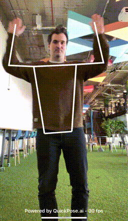   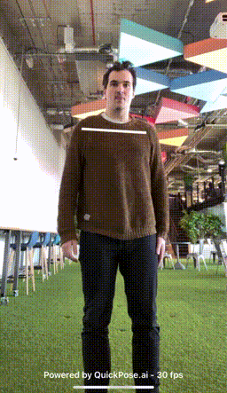  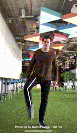  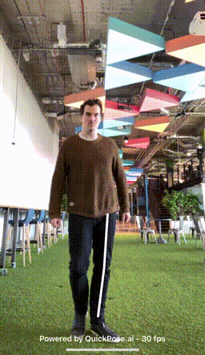| v0.1        |
| <p><b>Health - Range Of Motion</b></p><p>Left Shoulder</p><p>Right Shoulder</p><p>Left Hip</p><p>Right Hip</p><p>Left Knee</p><p>Right Knee</p><p>Back</p><p>Neck</p>       |  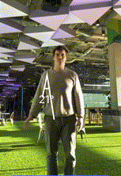      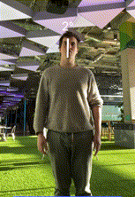  | v0.3      |
| <p><b>Fitness - Exercise Detection & Counter</b></p><p>Squat</p><p>Jumping Jack</p>      |  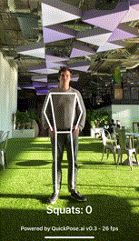 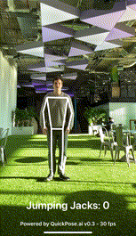  | v0.3 |      

Meta Features
------------------

| Feature       | Example       | Supported |
| ------------- |:-------------:| ---------:|
| Stacked Feature Styling | 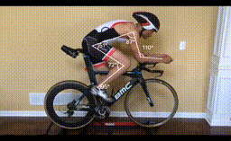<br />[<small>Bike Side View Video by Tariq Ali</small>](https://www.youtube.com/watch?v=LRA4N5cGnLU) | v0.4 |   
| Conditional Styling | 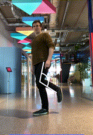 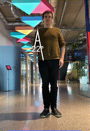  | v0.4 |      

Supported Platforms
------------------

| iOS Device | Silicon Mac (M1, M2, etc) | iOS Simulator x86_64 | iOS Simulator arm64  | 
| ----------:| -------------------------:|---------------------:|---------------------:|
| ✅ Runs    |                   ✅ Runs |          ⚙ Compiles |          ⚙ Compiles  |

Requirements
------------------

- iOS 14.0+ 
- Xcode 10.0+

Installing the SDK
------------------

### Swift Package Manager

__Step 1__: Click on Xcode project file

__Step 2__: Click on Swift Packages and click on the plus to add a package

__Step 3__: Enter the following repository url `https://github.com/quickpose/quickpose-ios-sdk.git` and click next

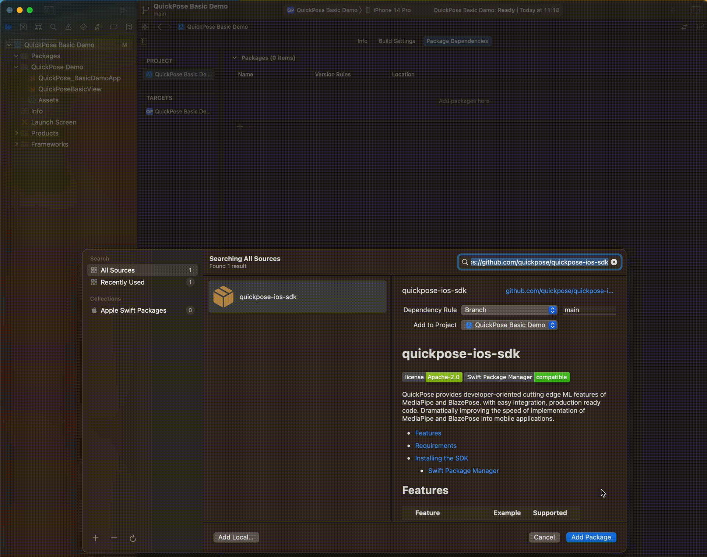

__Step 4__: Choose all modules and click add package.

| Module        | Description         |
| --------------|--------------------:|
| QuickPoseCore | Core SDK (required) |
| QuickPoseMP   | Mediapipe Library (required) |
| QuickPoseCamera | Utility Class for Integration  (optional, recommended) |
| QuickPoseSwiftUI | Utility Classes for SwiftUI Integration  (optional, recommended)|

Get an SDK Key
------------------

Register for your free SDK key on [https://dev.quickpose.ai](https://dev.quickpose.ai), usage limits apply. 
SDK Keys are linked to your bundle ID, please check your SDK Key before distributing to the App Store.

Getting Started
------------------

See code examples below or download our [Sample Apps](/SampleApps).

### Getting Started with Newer Macs M1/M2

__Step 1__: Download/Clone Repo

__Step 2__: Open Basic Demo

__Step 3__: Choose Build Target "My Mac (Designed For iPad/iPhone)"

__Step 4__: Run

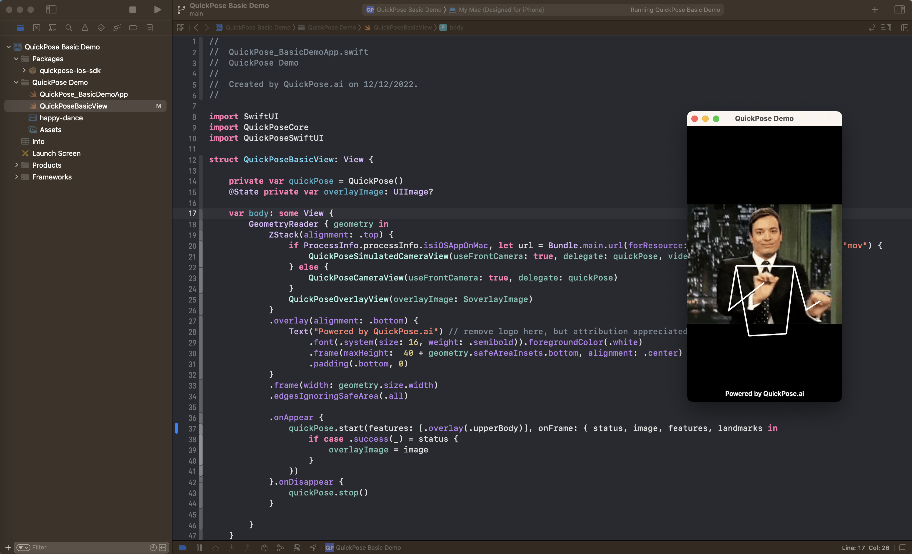

__Step 5__: Explore the features and returned results

```swift
quickPose.start(features: [.overlay(.upperBody)], onFrame: { status, image, features, landmarks in
    if case .success(_) = status {
        overlayImage = image
    }
})
```

### Getting Started with Older Intel Macs

__Step 1__: Download/Clone Repo

__Step 2__: Open Basic Demo

__Step 3__: Choose Build Target as your physical device

__Step 5__: You will need to change the bundleid and register with apple if you haven't already.

__Step 5__: Run

__Step 6__: Explore the features and returned results

```swift
quickPose.start(features: [.overlay(.upperBody)], onFrame: { status, image, features, landmarks in
    if case .success(_) = status {
        overlayImage = image
    }
})
```

### Integrating into SwiftUI App

#### Device Camera only
```swift
import SwiftUI
import QuickPoseCore
import QuickPoseSwiftUI

....

struct QuickPoseBasicView: View {
    
    private var quickPose = QuickPose(sdkKey: "YOUR SDK KEY HERE")
    @State private var overlayImage: UIImage?
    
    var body: some View {
        GeometryReader { geometry in
            ZStack(alignment: .top) {
                QuickPoseCameraView(useFrontCamera: true, delegate: quickPose)
                QuickPoseOverlayView(overlayImage: $overlayImage)
            }
            .frame(width: geometry.size.width)
            .edgesIgnoringSafeArea(.all)
            .onAppear {
                quickPose.start(features: [.overlay(.userLeftArm)], onFrame: { status, image, features, landmarks in
                    if case .success(_) = status {
                        overlayImage = image
                    }
                })
            }.onDisappear {
                quickPose.stop()
            }
            
        }
    }
}
```
#### Device Camera and Running Video on Mac (Recommended)
```swift
import SwiftUI
import QuickPoseCore
import QuickPoseSwiftUI
...
struct QuickPoseBasicView: View {

    private var quickPose = QuickPose(sdkKey: "YOUR SDK KEY HERE")
    @State private var overlayImage: UIImage?
    
    var body: some View {
        GeometryReader { geometry in
            ZStack(alignment: .top) {
                if ProcessInfo.processInfo.isiOSAppOnMac, let url = Bundle.main.url(forResource: "happy-dance", withExtension: "mov") {
                    QuickPoseSimulatedCameraView(useFrontCamera: true, delegate: quickPose, video: url)
                } else {
                    QuickPoseCameraView(useFrontCamera: true, delegate: quickPose)
                }
                QuickPoseOverlayView(overlayImage: $overlayImage)
            }
            .frame(width: geometry.size.width)
            .edgesIgnoringSafeArea(.all)
            .onAppear {
                quickPose.start(features: [.overlay(.upperBody)], onFrame: { status, image, features, landmarks in
                    if case .success(_) = status {
                        overlayImage = image
                    }
                })
            }.onDisappear {
                quickPose.stop()
            }
            
        }
    }
```
### Integrating into UIKit App

#### Device Camera only
```swift
import QuickPoseCore
import QuickPoseCamera
...

class ViewController: UIViewController {
    
    var camera: QuickPoseCamera?
    var quickPose = QuickPose(sdkKey: "YOUR SDK KEY HERE")
    
    @IBOutlet var cameraView: UIView!
    @IBOutlet var overlayView: UIImageView!
    
    override func viewDidLoad() {
        super.viewDidLoad()
        
        // setup camera
        camera = QuickPoseCamera(useFrontCamera: true)
        try? camera?.start(delegate: quickPose)
        
        let customPreviewLayer = AVCaptureVideoPreviewLayer(session: camera!.session!)
        customPreviewLayer.videoGravity = .resizeAspectFill
        customPreviewLayer.frame.size = view.frame.size
        cameraView.layer.addSublayer(customPreviewLayer)
        
        // setup overlay
        overlayView.contentMode = .scaleAspectFill // keep overlays in same scale as camera output
        overlayView.frame.size = view.frame.size
    }
    
    override func viewDidAppear(_ animated: Bool) {
        super.viewDidAppear(animated)
        
        quickPose.start(features: [.overlay(.userLeftArm)], onFrame: { status, image, features, landmarks in
            if case .success(_) = status {
                DispatchQueue.main.async {
                    self.overlayView.image = image
                }
            }
        })
    }
    
    override func viewDidDisappear(_ animated: Bool) {
        super.viewDidDisappear(animated)
        camera?.stop()
        quickPose.stop()
    }
}
```
#### Device Camera and Running Video on Mac (Recommended)
```swift
import QuickPoseCore
import QuickPoseCamera
...
class ViewController: UIViewController {
    
    var camera: QuickPoseCamera?
    var simulatedCamera: QuickPoseSimulatedCamera?
    var quickPose = QuickPose(sdkKey: "YOUR SDK KEY HERE")
    
    @IBOutlet var cameraView: UIView!
    @IBOutlet var overlayView: UIImageView!
    
    override func viewDidLoad() {
        super.viewDidLoad()
        
        if ProcessInfo.processInfo.isiOSAppOnMac, let url = Bundle.main.url(forResource: "happy-dance", withExtension: "mov") {
            simulatedCamera = QuickPoseSimulatedCamera(useFrontCamera: true, asset: AVAsset(url: url)) // setup simulated camera
            try? simulatedCamera?.start(delegate: quickPose)
            
            let customPreviewLayer = AVPlayerLayer(player: simulatedCamera?.player)
            customPreviewLayer.videoGravity = .resizeAspectFill
            customPreviewLayer.frame.size = view.frame.size
            cameraView.layer.addSublayer(customPreviewLayer)
        } else {
            camera = QuickPoseCamera(useFrontCamera: true) // setup camera
            try? camera?.start(delegate: quickPose)
            
            let customPreviewLayer = AVCaptureVideoPreviewLayer(session: camera!.session!)
            customPreviewLayer.videoGravity = .resizeAspectFill
            customPreviewLayer.frame.size = view.frame.size
            cameraView.layer.addSublayer(customPreviewLayer)
        }
        
        
        // setup overlay
        overlayView.contentMode = .scaleAspectFill // keep overlays in same scale as camera output
        overlayView.frame.size = view.frame.size
    }
    
    override func viewDidAppear(_ animated: Bool) {
        super.viewDidAppear(animated)
        
        quickPose.start(features: [.overlay(.upperBody)], onFrame: { status, image, features, landmarks in
            if case .success(_) = status {
                DispatchQueue.main.async {
                    self.overlayView.image = image
                }
            }
        })
    }
    
    override func viewDidDisappear(_ animated: Bool) {
        super.viewDidDisappear(animated)
        camera?.stop()
        simulatedCamera?.stop()
        quickPose.stop()
    }
}

```


Troubleshooting
------------------

### No Such Module

Xcode reports error no such module `QuickPoseCore` or no such module `QuickPoseSwiftUI`

> This happens when the linker cannot find the provided XCFrameworks. These needs to be added to your build Target. 

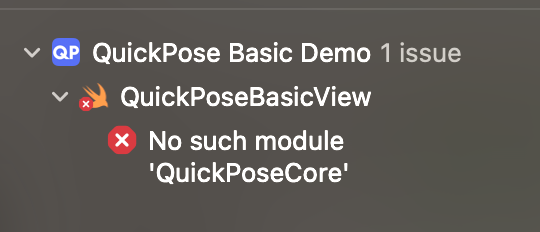

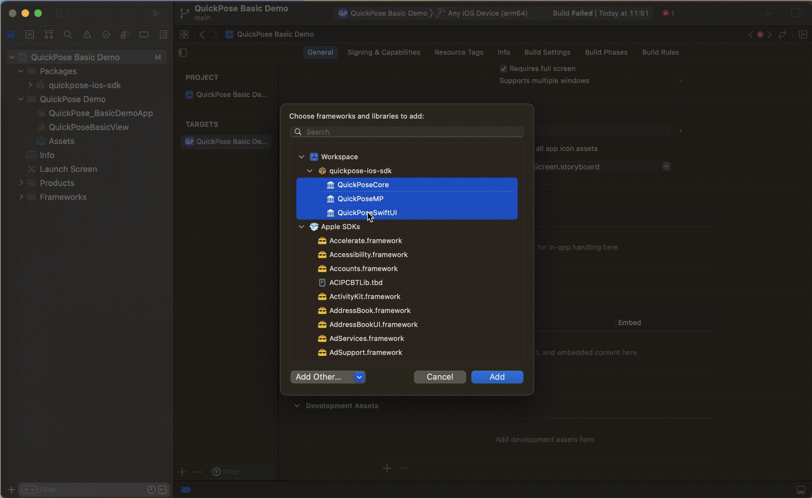

