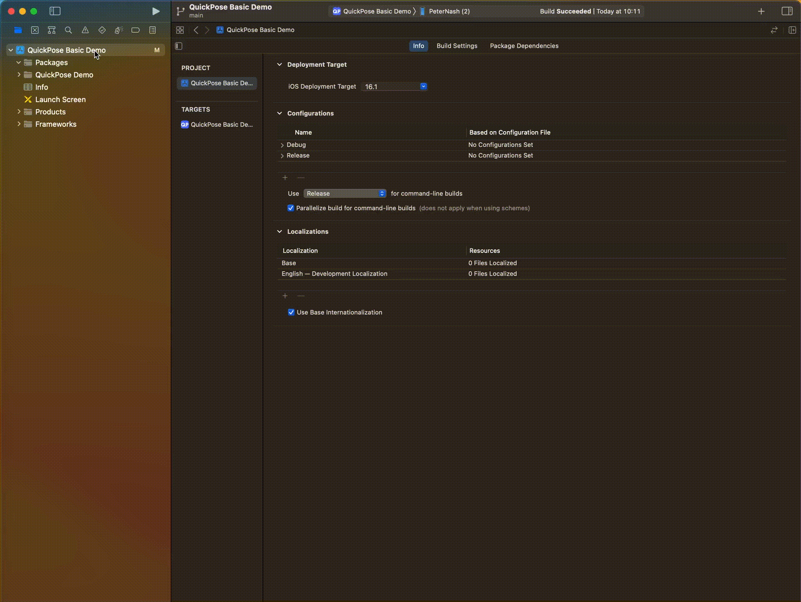

# QuickPoseiOS

 

QuickPose provides developer-oriented cutting edge ML features with easy integration and production ready code.

QuickPose iOS SDK
- [Requirements](#requirements)
- [Installing the SDK](#installing-the-sdk)
- [Swift Package Manager](#swift-package-manager)
  - [Importing QuickPoseSDK into Project](#importing-quickposesdk-into-project)
- [Getting Started](#getting-started)
- [Sample Apps](#sample-apps)

<!-- END doctoc generated TOC please keep comment here to allow auto update -->

Requirements
------------------

- iOS 14.0+ 
- Xcode 10.0+

Installing the SDK
------------------

### Swift Package Manager

#### Importing QuickPoseSDK into Project

__Step 1__: Click on Xcode project file

__Step 2__: Click on Swift Packages and click on the plus to add a package

__Step 3__: Enter the following repository url `https://github.com/quickpose/QuickPoseiOS.git` and click next

